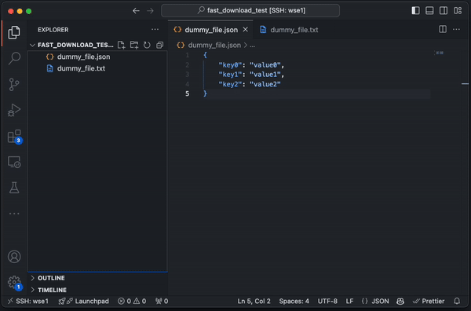

# Remote - SSH: Fast Download

Allows for fast and efficient downloads of files and directories from a **VSCode Remote SSH** session to your local machine.

## Demo

## Features

- **Fast File Downloads**: Quickly download files or directories from remote servers connected via SSH directly to your local machine.
- **Multiple File Selection**: Supports downloading multiple files or directories simultaneously.
- **Rsync-Based Transfers**: Utilizes `rsync` for optimized and reliable synchronization between remote servers and your local machine.
- **Automatic Rsync Installation and Version Check**: Automatically checks if `rsync` is installed and up-to-date on your local machine, providing guidance for installation or updates.
- **Passwordless SSH Authentication Detection**: Detects if passwordless SSH authentication is not set up and provides clear instructions for configuration.
- **Remembers Last Download Location**: Automatically suggests the previously used download directory for convenience.

## Benefits

- **Speed and Efficiency**: Uses `rsync`'s differential transfer capability, ensuring only changed files are copied, making downloads faster and more efficient.
- **Seamless Workflow**: Download files directly from the **VSCode Explorer context menu** without switching to external tools like FileZilla.
- **Enhanced Security**: Encourages the use of SSH keys for passwordless authentication, improving security while reducing the hassle of entering passwords.

## Requirements

1. **Visual Studio Code**: Version **1.60.0** or higher.
2. **Remote SSH Extension**: The official **VSCode Remote - SSH** extension for connecting to remote servers.
3. **Rsync**: Installed on both the local and remote machines.
   - **MacOS**: Ensure `rsync` version **3.0.0** or higher is installed (the default version on macOS is outdated).
4. **Passwordless SSH Authentication**: Configure SSH key-based authentication for seamless operation.

## Installation

### From the VSCode Marketplace

- Open **Visual Studio Code**.
- Go to the **Extensions** view (`Ctrl+Shift+X` or `Cmd+Shift+X`).
- Search for **"SSH Fast Download"** or **"compress-download-extension"**.
- Click **Install**.

### Manual Installation

- If you have the `.vsix` file:
  - Open **Visual Studio Code**.
  - Go to the **Extensions** view.
  - Click on the three-dot menu (`...`) in the top-right corner.
  - Select **"Install from VSIX..."**.
  - Choose the `.vsix` file you downloaded or packaged.

## Usage

1. **Connect to a Remote SSH Session**:
   - Use the **Remote - SSH** extension to connect to your remote server.

2. **Download Files or Directories**:
   - In the **Explorer** view, select one or multiple files or directories.
   - Right-click on the selection.
   - Choose **"Fast Download"** from the context menu.
   - When prompted, enter the destination path on your local machine (default is your **Downloads** folder).
   - The extension will use `rsync` to transfer the selected items from the remote server to your local destination.

3. **Monitor Progress**:
   - The extension will display progress and output in the **"Fast Download"** output channel.
   - Notifications will inform you when the download is complete or if any errors occur.

## Extension Settings

- **`fastDownload.defaultDownloadLocation`**:
  - Allows you to set a default download directory on your local machine.
  - Default: `""`.

## Known Issues

1. **Windows Support**:
   - The extension currently does not support Windows as the local machine.

2. **Outdated Rsync on macOS**:
   - The default version of `rsync` on macOS is outdated. Use Homebrew to install or update `rsync` to version **3.0.0** or higher.

3. **Passwordless SSH Authentication**:
   - Passwordless SSH authentication is required for the extension to function properly. If not set up, the extension will guide you through the setup process.

## Contributing
Contributions are welcome! Please submit issues or pull requests to the [GitHub repository](https://github.com/SamueleTorregrossa/vsc-download-compressed).

## License

This project is licensed under the [MIT License](LICENSE).
